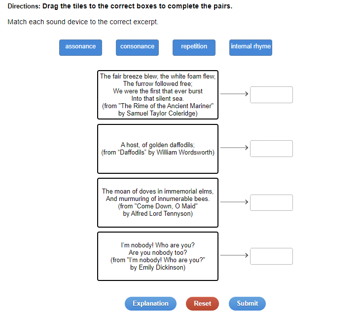
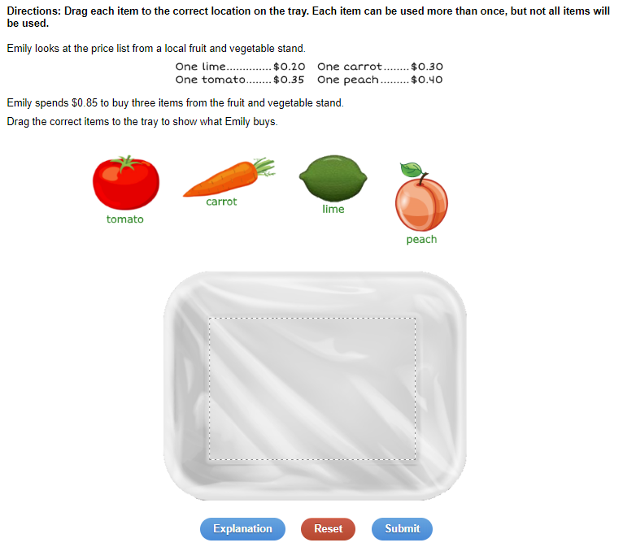
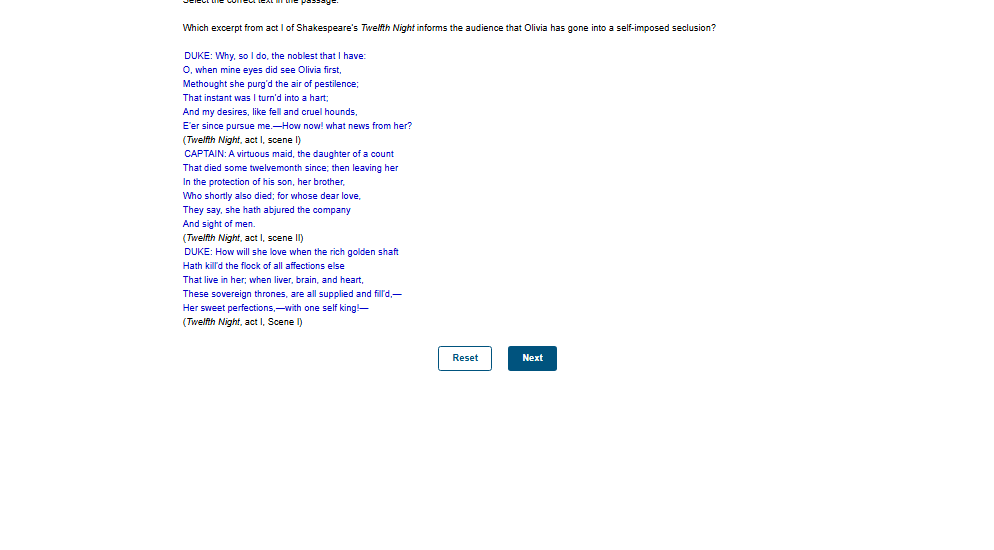
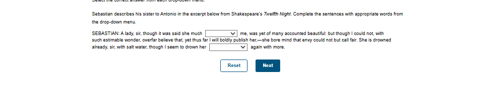
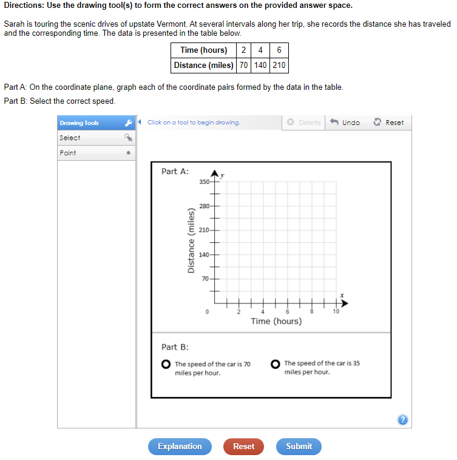
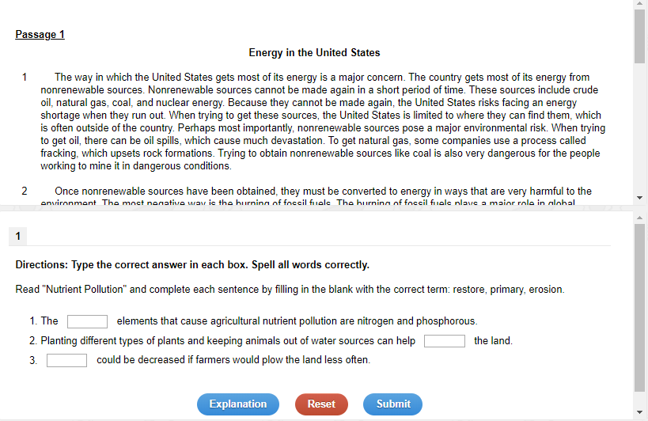
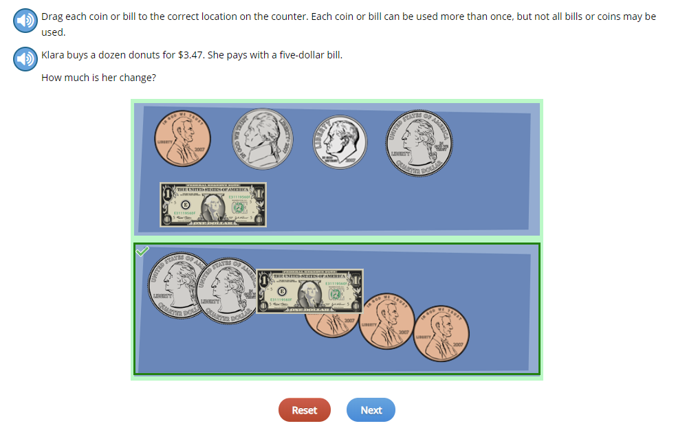
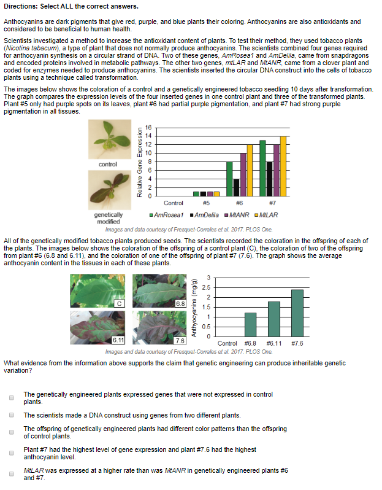
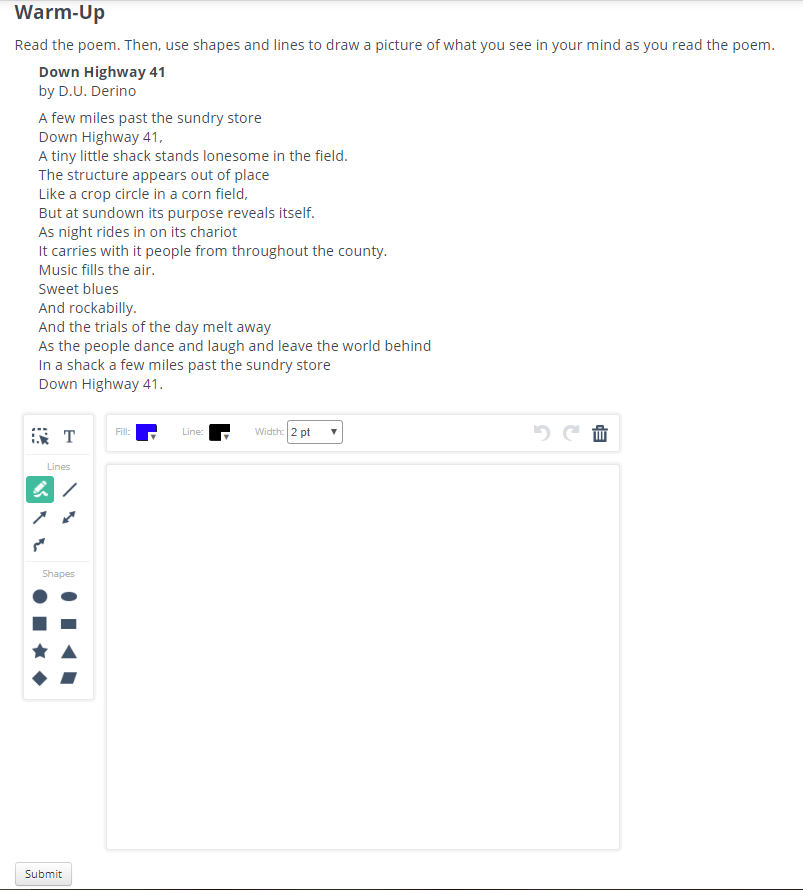

# Test Screenshots for Edmentum Item Types

This directory contains reference screenshots for testing all 15 Edmentum technology-enhanced item types.

## 📸 Complete Set of 15 Edmentum Question Types

**All 15 official Edmentum item type examples are included!**

Images sourced from: [Edmentum Official Article](https://www.edmentum.com/intl/articles/15-technology-enhanced-item-types-promote-critical-thinking/)

---

## 📋 15 Edmentum Item Types

### 1. Hot Spot

**Description**: Students identify a location on an image that represents the correct answer
**File**: `01_hot_spot.png`

---

### 2. Matched Pairs

**Description**: Students drag answers from one section to another to create matching pairs
**File**: `02_matched_pairs.png`

---

### 3. Graphic Gap Match

**Description**: Students drag and drop item(s) into the designated target(s) to form the correct answer(s)
**File**: `03_graphic_gap_match.png`

---

### 4. Constructed Response

**Description**: Students create a response using evidence from the question or reading passage to support their view
**File**: `04_constructed_response.png`

---

### 5. Hot Text ⭐ (Authentic)

**Description**: Text choices are identified for students within a passage, and students select the correct text answer(s)
**File**: `05_hot_text.png`
**Note**: This is an authentic Edmentum screenshot from Shakespeare's Twelfth Night

---

### 6. Cloze ⭐ (Authentic)

**Description**: Students select the correct answer from a drop-down box within an equation or sentence
**File**: `06_cloze_dropdown.png`
**Note**: This is an authentic Edmentum screenshot from Shakespeare's Twelfth Night

---

### 7. Graphing

**Description**: Students must use provided drawing tools to plot their answer(s) on a coordinate grid
**File**: `07_graphing.png`

---

### 8. Fill in the Blank

**Description**: Students enter an alphanumeric response in an open box within a question
**File**: `08_fill_blank.png`

---

### 9. Sequence

**Description**: Students select and move images or phrases to the correct location, placing them in sequence
**File**: `09_sequence.png`

---

### 10. Graphic Tally

**Description**: Students drag and drop visible or invisible tile(s) into designated target(s) to form correct answer(s)
**File**: `10_graphic_tally.png`

---

### 11. Multi-Part

**Description**: Students must answer two or more parts to a question
**File**: `11_multi_part.png`

---

### 12. Number Line

**Description**: Students must use provided drawing tools to plot their answer(s) on a number line
**File**: `12_number_line.png`

---

### 13. Multiple Response

**Description**: Students can select more than one correct answer to a given question
**File**: `13_multiple_response.png`

---

### 14. Freehand Drawing

**Description**: Students use a drawing tool interaction to draw against a prepopulated background image
**File**: `14_freehand_drawing.png`
**Note**: Activities only

---

### 15. Equation

**Description**: Students must enter their response using math notation
**File**: `15_equation.png`

---

## 🧪 Testing Instructions

1. **Launch the app**: `python main.py`
2. Click **"📁 Load Screenshot"** button
3. Navigate to `test_screenshots/` directory
4. Select any of the 15 numbered PNG files (01-15)
5. Click **"Get AI Answer"** to test rendering
6. Verify the answer displays correctly with Edmentum styling

## 📝 Expected Rendering:

- **Hot text questions**: Green highlighted passages (not just text answers)
- **Matching pairs**: 2-column layout with visual connections
- **Multiple choice**: Radio button styling and correct answer highlighting
- **Cloze/Dropdown**: Inline dropdown selections properly filled
- **All questions**: Edmentum color scheme (green for correct, blue accents)

## ⚠️ Report Issues

If any question type renders incorrectly, use the **"Report Error"** button in the app to automatically send a detailed report with screenshots to the developer.

---

**Last Updated**: 2025-10-31 | v1.0.24
**Source**: Official Edmentum CDN + 2 Authentic Screenshots
